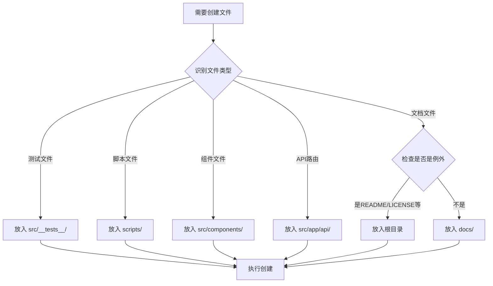

# AI助手行为规范指南

> **创建日期**: 2026-01-28
> **目的**: 说明如何规范AI助手行为，避免文件组织混乱

---

## 📋 问题背景

在之前的开发过程中，AI助手（Claude Code）在根目录直接创建了大量文档文件，导致项目根目录混乱。为了解决这个问题，我们创建了AI助手行为规范文件。

---

## 🎯 解决方案

### 1. 创建规范文件

项目中现在有**两个**AI助手规范文件：

#### `.clinerules` (Cline AI的规范)
- **位置**: 项目根目录
- **适用于**: Cline AI助手
- **格式**: JSON
- **创建时间**: 2026-01-11

#### `.claudecoderules` (Claude Code的规范)
- **位置**: 项目根目录
- **适用于**: Claude Code AI助手
- **格式**: JSON
- **创建时间**: 2026-01-28

---

## 📝 规范文件内容

### 核心规则层级

两个规范文件都包含以下层级的规则：

```
CRITICAL_RULES          (关键规则 - 必须严格遵守)
    ↓
FILE_ORGANIZATION_RULES (文件组织规范 - 必须严格遵守)
    ↓
CODE_QUALITY_RULES      (代码质量规范 - 强烈建议)
    ↓
TESTING_RULES          (测试规范 - 强烈建议)
    ↓
PERFORMANCE_RULES      (性能规范 - 建议遵守)
```

---

### 文件组织规范 (最重要)

#### 📄 文档文件位置规则

```json
{
  "documentation_files": {
    "location": "docs/",
    "description": "所有文档文件必须放在docs/目录下",
    "examples": [
      "技术文档: docs/TECHNICAL_GUIDE.md",
      "API文档: docs/API_DOCUMENTATION.md",
      "完成总结: docs/COMPLETION_SUMMARY.md"
    ],
    "exceptions": [
      "README.md - 放在根目录",
      "CHANGELOG.md - 放在根目录",
      "LICENSE - 放在根目录",
      "CONTRIBUTING.md - 放在根目录"
    ]
  }
}
```

#### 🧪 测试文件位置规则

```json
{
  "test_files": {
    "location": "src/__tests__/",
    "description": "所有测试文件必须放在src/__tests__/目录下",
    "naming_convention": "*.test.ts, *.test.tsx, *.spec.ts",
    "structure": {
      "unit_tests": "src/__tests__/unit/",
      "integration_tests": "src/__tests__/integration/",
      "e2e_tests": "src/__tests__/e2e/"
    }
  }
}
```

#### 📜 脚本文件位置规则

```json
{
  "script_files": {
    "location": "scripts/",
    "description": "所有脚本文件必须放在scripts/目录下",
    "examples": [
      "scripts/seed.ts - 数据库种子脚本",
      "scripts/migrate.ts - 数据库迁移脚本",
      "scripts/deploy.sh - 部署脚本"
    ]
  }
}
```

---

## 🔧 已执行的整改行动

### 2026-01-28 文件整理

我们执行了以下整改：

#### ✅ 创建规范文件
```bash
# 创建Claude Code规范文件
.claudecoderules (新增)
```

#### ✅ 移动文档到正确位置

**移动的文档（15个）**:
```bash
# Stage相关文档
STAGE2_STAGE3_FINAL_SUMMARY.md     → docs/
STAGE3_COMPLETION_SUMMARY.md       → docs/
STAGE_2_3_REVIEW_REPORT.md         → docs/
STAGE2_COMPLETION_SUMMARY.md       → docs/
STAGE2_USAGE_GUIDE.md              → docs/

# 优化计划文档
OPTIMIZATION_PLAN.md               → docs/
OPTIMIZATION_PROGRESS.md           → docs/

# 技术文档
DEBUG_COOKIE_FLOW.md               → docs/
DOWNGRADE_TAILWIND.md              → docs/
TESTING_GUIDE.md                   → docs/

# 测试报告
test-implementation-summary.md     → docs/
test-findings-report.md            → docs/

# 问题修复文档
QUICK_FIX_SUMMARY.md               → docs/
eslint-analysis-report.md          → docs/
eslint-summary-report.md           → docs/

# 其他
SETUP_COMPLETE.md                  → docs/
task_progress.md                   → docs/
```

#### ✅ 创建文档索引

```bash
# 创建文档导航文件
docs/INDEX.md (新增)
```

#### ✅ 更新README

在 `README.md` 中添加了"📚 文档导航"部分，指向 `docs/INDEX.md`。

---

## 📂 整理后的目录结构

### 根目录（清爽）

```
legal_debate_mvp/
├── README.md                     ← 唯一保留的Markdown文件
├── .clinerules                   ← Cline AI规范
├── .claudecoderules              ← Claude Code规范
├── package.json
├── tsconfig.json
├── .env
├── src/
├── docs/                         ← 所有文档在这里
├── scripts/                      ← 所有脚本在这里
├── prisma/
└── ...其他配置文件
```

### docs/目录（完整）

```
docs/
├── INDEX.md                               ← 文档导航索引
├──
├── 📊 完成总结
│   ├── STAGE2_STAGE3_FINAL_SUMMARY.md
│   ├── STAGE2_COMPLETION_SUMMARY.md
│   ├── STAGE3_COMPLETION_SUMMARY.md
│   └── STAGE_2_3_REVIEW_REPORT.md
├──
├── 📖 使用指南
│   ├── STAGE2_USAGE_GUIDE.md
│   ├── DATABASE_OPTIMIZATION_GUIDE.md
│   └── TESTING_GUIDE.md
├──
├── 🔧 技术文档
│   ├── DEBUG_COOKIE_FLOW.md
│   └── DOWNGRADE_TAILWIND.md
├──
└── ... 其他58个文档
```

---

## 🎯 AI助手工作流程

AI助手在创建文件时应遵循的流程：



---

## 📋 检查清单

AI助手在创建文件前应执行的检查：

### ✅ 文件创建前检查清单

- [ ] 识别文件类型（文档/测试/脚本/组件/配置）
- [ ] 确认目标目录（根据规范文件）
- [ ] 检查是否有例外情况（如README.md）
- [ ] 验证目标目录是否存在
- [ ] 确认文件命名符合规范
- [ ] 避免创建重复文件

### ✅ 文件创建后验证

- [ ] 文件已创建在正确位置
- [ ] 文件命名符合规范
- [ ] 相关文档已更新
- [ ] 没有破坏现有结构

---

## 🔍 如何检查AI助手是否遵守规范

### 方法1: 检查规范文件

```bash
# 查看Cline规范
cat .clinerules

# 查看Claude Code规范
cat .claudecoderules
```

### 方法2: 检查根目录

```bash
# 列出根目录的Markdown文件（应该只有README.md）
ls -la *.md
```

### 方法3: 检查docs目录

```bash
# 查看docs目录结构
ls -la docs/

# 查看文档索引
cat docs/INDEX.md
```

---

## 🚀 开发者使用指南

### 如何添加新规则

1. **编辑规范文件**:
   ```bash
   # 编辑Cline规范
   vim .clinerules

   # 编辑Claude Code规范
   vim .claudecoderules
   ```

2. **添加规则**:
   ```json
   {
     "NEW_RULE_CATEGORY": {
       "description": "规则说明",
       "rules": {
         "rule_name": "规则内容"
       }
     }
   }
   ```

3. **测试规则**:
   - 要求AI助手创建文件
   - 验证是否遵守新规则

---

## 📊 规范执行效果

### 整理前

```
legal_debate_mvp/
├── README.md
├── STAGE2_STAGE3_FINAL_SUMMARY.md        ← 混乱
├── STAGE3_COMPLETION_SUMMARY.md          ← 混乱
├── OPTIMIZATION_PLAN.md                   ← 混乱
├── DEBUG_COOKIE_FLOW.md                   ← 混乱
├── ... 15个文档文件 ...                   ← 混乱
├── package.json
├── tsconfig.json
└── src/
```

### 整理后

```
legal_debate_mvp/
├── README.md                              ← 清爽
├── .clinerules                            ← 规范
├── .claudecoderules                       ← 规范
├── package.json
├── tsconfig.json
├── docs/                                  ← 所有文档
│   ├── INDEX.md
│   ├── STAGE2_STAGE3_FINAL_SUMMARY.md
│   └── ... 58个文档 ...
└── src/
```

---

## 🎯 最佳实践

### DO ✅

1. **创建文档前检查规范文件**
2. **使用文档索引快速定位**
3. **遵守文件组织规范**
4. **及时更新文档索引**
5. **保持根目录清爽**

### DON'T ❌

1. ~~在根目录创建任意Markdown文件~~
2. ~~创建重复的增强版文件~~
3. ~~忽视规范文件的规则~~
4. ~~在错误的目录创建文件~~
5. ~~硬编码路径和敏感信息~~

---

## 🔗 相关资源

- [.clinerules](./.clinerules) - Cline AI规范
- [.claudecoderules](./.claudecoderules) - Claude Code规范
- [docs/INDEX.md](./INDEX.md) - 文档索引
- [README.md](../README.md) - 项目概览

---

## 📝 维护记录

| 日期 | 操作 | 说明 |
|------|------|------|
| 2026-01-11 | 创建 | 创建 .clinerules 文件 |
| 2026-01-28 | 创建 | 创建 .claudecoderules 文件 |
| 2026-01-28 | 整理 | 移动15个文档到docs/目录 |
| 2026-01-28 | 创建 | 创建 docs/INDEX.md 文档索引 |
| 2026-01-28 | 更新 | 更新 README.md 添加文档导航 |

---

## 🎉 总结

通过创建规范文件和执行文件整理，我们实现了：

✅ **根目录清爽**: 只保留README.md等标准文件
✅ **文档集中**: 所有文档统一在docs/目录
✅ **易于查找**: 通过INDEX.md快速定位文档
✅ **AI规范**: AI助手遵守明确的文件组织规则
✅ **可维护性**: 清晰的目录结构便于长期维护

---

**文档维护**: 规范文件应随项目演进持续更新
**执行监督**: 定期检查AI助手是否遵守规范
**持续改进**: 根据实际使用情况优化规则
