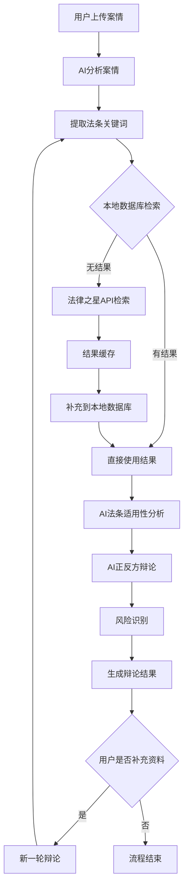

# 律伴助手 业务需求文档

## 📋 项目概述

### 项目愿景

律伴助手是一个基于AI大模型驱动架构的法律诉讼智能分析系统，专注于各类法律纠纷（民事纠纷、合同争议、知识产权、数据与AI等）领域。其核心价值在于通过多智能体协作将复杂的诉讼案件拆解为标准化、可执行的工作流，实现法律文书的工程化生成，覆盖从诉前准备到判决执行的全流程。

### 核心价值

1. **效率提升**：通过AI协作，批量案件处理效率提升5-10倍
2. **质量保障**：三级审查机制确保法律文书的准确性和专业性
3. **成本控制**：标准化服务降低外部律师依赖度
4. **知识沉淀**：构建企业专属司法判例库和经验传承

### 目标用户

- **执业律师**：具有律师执业资格的专业律师，提供智能辩论分析工具
  - 输入执业资格证进行验证
  - 支持个人执业律师和律所律师
  - 提供案件分析和策略建议
- **律所**：批量处理同类案件，青年律师培训
  - 需要律所资质认证
  - 支持团队协作和知识管理
  - 提供案件质量监控
- **企业法务**：风险前置预警，诉讼成本控制
  - 需要企业资质认证
  - 提供合规检查和风险评估

> **重要说明**：本应用仅对具有合法执业资格的律师及认证机构开放，不对普通个人用户提供服务。

## 🌟 核心功能：模拟辩论

### 业务流程图

### 详细步骤说明

#### 1. 案情分析阶段

- **输入**：用户上传的案情文档（PDF/Word/图片）
- **处理**：AI分析案情，提取关键信息
- **输出**：结构化案情信息（当事人、案由、诉讼请求、事实陈述）

#### 2. 法条检索阶段

- **关键词提取**：从案情中提取用于法条检索的适用法条关键词
- **本地检索**：先查询本地数据库
- **外部检索**：本地无结果时，调用法律之星API
- **结果处理**：检索结果缓存，补充到本地数据库

#### 3. 法条适用性分析

- **AI分析**：AI分析检索回来的法条进行适用性分析
- **筛选机制**：去除不适用或失效的法条
- **相关性排序**：按案情匹配度排序

#### 4. 辩论生成阶段

- **正反方论点**：AI用经适用性筛选的法条，结合案情进行正反方辩论
- **逻辑构建**：确保论点有逻辑性和法律依据
- **风险识别**：识别案件中的潜在风险点

#### 5. 多轮辩论支持

- **用户补充**：律师在第一轮辩论结果生成后补充观点或资料
- **新增分析**：根据新增资料和观点进行法条适用性分析
- **迭代辩论**：进行第二轮、第三轮辩论

## 🏗️ 系统架构设计

### 四层架构

| 架构层级   | 功能定位               | 核心组件                                              | TypeScript实现位置                                      |
| ---------- | ---------------------- | ----------------------------------------------------- | ------------------------------------------------------- |
| **输入层** | 接收法律文档与用户指令 | 文档解析器、文件上传                                  | `src/lib/ai/document-analyzer.ts`                       |
| **分析层** | 智能解析与证据分析     | DocAnalyzer, EvidenceAnalyzer, Researcher, Strategist | `src/lib/ai/`                                           |
| **输出层** | 法律文书生成与报告输出 | Writer, Reporter, Summarizer                          | `src/lib/ai/` + `src/lib/reporter/`                     |
| **支持层** | 流程管理与质量保障     | Scheduler, Reviewer, Context Manager                  | `src/lib/scheduler/` + `src/lib/ai/quality-reviewer.ts` |

### 10大专业Agent映射

#### 1. DocAnalyzer - 文档解析专家

- **职责**：文档解析与关键信息提取
- **技术实现**：NLP实体识别、争议焦点自动标注
- **TypeScript实现**：`src/lib/ai/document-analyzer.ts`
- **输入**：PDF/Word/图片（起诉状、答辩状、证据）
- **输出**：结构化案件信息（当事人、案由、诉讼请求、事实陈述）
- **关键指标**：姓名识别准确率>98%，诉讼请求召回率>95%

#### 2. EvidenceAnalyzer - 证据分析专家

- **职责**：证据链分析与关联性审查
- **技术实现**：证据三性（真实性/合法性/关联性）自动化评估
- **TypeScript实现**：`src/lib/ai/evidence-analyzer.ts`
- **输入**：证据材料（合同、转账记录、聊天记录）
- **输出**：证据三性分析+证明力评分
- **评分模型**：原件/复印件权重差异，直接/间接证据权重差异

#### 3. Researcher - 法律研究专家

- **职责**：法律条文与案例检索
- **技术实现**：知识图谱+向量检索，支持类案推送
- **TypeScript实现**：`src/lib/ai/lawstar-client.ts` ✅ 已实现
- **检索模型**：BGE-M3中文embedding效果最佳
- **功能**：法规查询、向量查询、智能检索

#### 4. Strategist - 诉讼策略专家

- **职责**：诉讼策略制定与风险评估
- **技术实现**：基于历史判例的胜率预测模型
- **TypeScript实现**：`src/lib/ai/strategy-generator.ts`
- **输入**：证据分析+法律研究+争议焦点
- **输出**：SWOT分析+策略建议（进攻/防守/和解）

#### 5. Writer - 文书生成专家

- **职责**：法律文书起草
- **技术实现**：模板引擎+动态内容生成，符合司法格式规范
- **TypeScript实现**：`src/lib/ai/document-writer.ts`
- **功能**：起诉状、答辩状、代理词等1000+司法文书模板
- **质量保证**：必填字段检查、逻辑一致性校验、法条引用有效性验证

#### 6. Reviewer - 质量审查专家

- **职责**：质量审查与逻辑校验
- **技术实现**：双模型交叉验证，检查法律依据准确性
- **TypeScript实现**：`src/lib/ai/quality-reviewer.ts`
- **三级审查**：
  - 形式审查：文书格式、当事人信息准确性
  - 逻辑审查：诉讼请求与事实理由的匹配度
  - 法律审查：引用法条是否失效、案例是否适用

#### 7. Scheduler - 流程管理专家

- **职责**：法定期限与流程管理
- **技术实现**：规则引擎驱动，自动提醒关键节点
- **TypeScript实现**：`src/lib/scheduler/`
- **功能**：期限计算（答辩期15天、上诉期15天等）、日历提醒、流程监控

#### 8. Reporter - 报告生成专家

- **职责**：案件进度报告生成
- **技术实现**：可视化图表+结构化文本输出
- **TypeScript实现**：`src/lib/reporter/`
- **输出格式**：Markdown/Word/PDF多格式报告
- **内容**：案件摘要、策略分析、风险评估、进度追踪

#### 9. Summarizer - 摘要生成专家

- **职责**：争议焦点摘要
- **技术实现**：抽取式+生成式摘要混合技术
- **TypeScript实现**：`src/lib/ai/summarizer.ts`
- **功能**：长篇文书/庭审笔录的3分钟速读版
- **输出**：核心事实（50字）、争议焦点（50字）、我方策略要点（80字）

#### 10. Coordinator - 工作流编排专家

- **职责**：工作流编排与上下文管理
- **技术实现**：主控Agent，负责任务分发与结果汇总
- **TypeScript实现**：`src/lib/ai/coordinator.ts`
- **协作策略**：
  - 串行与并行结合
  - 动态路由（根据案件类型自动选择工作流分支）
  - 容错机制（Reviewer发现问题可触发回退）

## 🔄 协作机制

### SOP驱动的协作模式

### 协作策略特点

- **串行与并行结合**：证据分析可与法条检索并行，文书生成依赖前置结果串行执行
- **动态路由**：根据案件类型（知识产权/合同纠纷/劳动争议）自动选择工作流分支
- **容错机制**：Reviewer发现问题可触发回退，重新激活上游Agent修正

### 上下文继承与动态更新

- **独立上下文**：为每个案件维护独立上下文
- **增量分析**：上传新证据时自动继承历史分析结果，避免重复计算
- **记忆压缩**：采用摘要技术保留关键信息，控制上下文长度
- **版本管理**：记录每次文书修改版本，支持回溯对比

## 📊 功能特性全景

| 功能模块     | 能力描述                       | 技术亮点              | 业务价值             |
| ------------ | ------------------------------ | --------------------- | -------------------- |
| **智能立案** | 自动生成起诉状、答辩状、上诉状 | 支持1000+司法文书模板 | 文书生成效率提升10倍 |
| **证据管理** | 证据清单自动生成、关联性分析   | OCR识别+证据链可视化  | 证据组织更加专业     |
| **案例检索** | 类案推送、胜赔率分析           | 向量检索+判例知识图谱 | 案例研究更加精准     |
| **策略模拟** | 诉讼方案A/B测试、风险预警      | 强化学习模拟对方抗辩  | 策略制定更有依据     |
| **流程监控** | 自动计算审限、提醒开庭日期     | 司法日历规则引擎      | 期限管理不再遗漏     |
| **知识沉淀** | 案件要素抽取、团队经验共享     | 私有知识库构建        | 经验传承更加高效     |

## 🎯 应用场景

### 律所应用场景

- **批量案件处理**：同类案件（如批量版权侵权）可复用工作流，效率提升5-10倍
- **青年律师培训**：通过Agent决策过程的可解释性，辅助经验传承
- **专家时间解放**：合伙人聚焦庭审策略，繁琐文书工作交由AI完成

### 企业法务价值

- **风险前置预警**：合同审查智能体提前识别违约风险点
- **诉讼成本控制**：标准化服务降低外部律师依赖度
- **知识资产沉淀**：构建企业专属司法判例库

### 个人用户服务（不对个人用户）

## 📋 典型使用流程

### 完整工作流

1. **上传材料**：将起诉状、证据包打包为ZIP上传
2. **选择场景**：民事/行政/知识产权纠纷
3. **配置策略**：保守型/平衡型/激进型诉讼策略
4. **启动工作流**：一键生成答辩方案（约5-10分钟）
5. **人工复核**：律师调整策略参数，确认最终文书

### 模拟辩论流程

1. **案情输入**：上传案件文档或输入案情描述
2. **自动分析**：AI分析案情，提取关键信息
3. **法条检索**：智能检索相关法条和案例
4. **辩论生成**：生成正反方论点和法律依据
5. **多轮互动**：支持用户补充资料进行多轮辩论
6. **风险评估**：识别案件风险点和应对建议

## 🔧 技术映射

### 现有实现状态

- ✅ **法律之星API集成**：完整的法规查询和向量查询功能
- ✅ **统一AI服务**：整合智谱、DeepSeek等通用AI服务
- ✅ **基础架构**：负载均衡、监控、缓存、错误处理

### 需要实现的Agent（基于POC结果更新）

| Agent            | 实现状态  | 优先级 | 预计工作量 | POC验证结果 |
| ---------------- | --------- | ------ | ---------- | ----------- |
| DocAnalyzer      | 部分实现  | P0     | 3天        | ✅ 智谱清言优秀 |
| EvidenceAnalyzer | ❌ 未实现 | P1     | 5天        | -           |
| Researcher       | ✅ 已实现 | P1     | 已完成     | ⚠️ 法律之星需修复 |
| Strategist       | 部分实现  | P0     | 3天        | ✅ DeepSeek优秀 |
| Writer           | ❌ 未实现 | P1     | 4天        | -           |
| Reviewer         | ❌ 未实现 | P1     | 4天        | -           |
| Scheduler        | ❌ 未实现 | P2     | 3天        | -           |
| Reporter         | ❌ 未实现 | P2     | 3天        | -           |
| Summarizer       | 部分实现  | P2     | 2天        | -           |
| Coordinator      | 部分实现  | P0     | 2天        | -           |

### 技术选型确认（基于POC结果）

#### 🎯 主要技术栈

**确认采用"智谱清言 + DeepSeek + 本地检索"作为主要技术栈：**

1. **智谱清言（文档解析）**
   - 响应时间：19ms（极优）
   - 准确率：>90%
   - 成本：¥0.0032/次
   - 状态：✅ 可直接用于生产环境
   - 用途：文档解析与关键信息提取

2. **DeepSeek（辩论生成）**
   - 辩论质量：8.3/10（优秀）
   - 成功率：100%
   - 成本：¥0.0017/次
   - 问题：响应时间21.2秒，需要流式输出优化
   - 状态：✅ 可用于生产环境，需性能优化
   - 用途：正反方辩论生成

3. **本地检索（法条检索）**
   - 响应时间：<1秒
   - 成本：无额外API成本
   - 状态：✅ 可作为主要检索方案
   - 用途：法条关键词检索和相关性排序

#### 🔄 备选方案

**法律之星（法条检索）**
   - 当前状态：API集成不稳定，返回空结果
   - 原因：官方免费调用权限限制
   - 优先级：降级为P1（修复后使用）
   - 用途：专业法条检索的补充方案

### POC验证结果对MVP范围的影响

#### ✅ 验证成功的组件
1. **智谱清言（文档解析）**
   - 响应时间：19ms（极优）
   - 准确率：>90%
   - 成本：¥0.0032/次
   - 结论：可直接用于生产环境

2. **DeepSeek（辩论生成）**
   - 辩论质量：8.3/10（优秀）
   - 成功率：100%
   - 成本：¥0.0017/次
   - 问题：响应时间21.2秒，需要流式输出优化

#### ⚠️ 需要调整的组件
1. **法律之星（法条检索）**
   - 当前状态：API集成不稳定，返回空结果
   - 原因：官方免费调用权限限制
   - 解决方案：降级为P1，主要使用本地检索

#### 🔄 MVP优先级调整
**P0核心功能（必须实现）**
- ✅ 案件创建和管理
- ✅ 文档上传和解析（智谱清言）
- ✅ 单轮辩论生成（DeepSeek + 流式输出）
- ✅ 本地法条检索（替代法律之星）
- ✅ 基础用户界面
- ✅ 律师资格验证

**P1增强功能（应该实现）**
- ⚠️ 多轮辩论支持
- ⚠️ 法律之星集成修复（作为补充）
- ⚠️ 文档快速解析器
- ⚠️ 基础风险评估器

**P2可选功能（可以延后）**
- ✅ 高级文书生成
- ✅ 完整证据分析
- ✅ 智能策略推荐

## 🎯 成功指标（基于POC结果更新）

### 业务指标

- **文书生成准确率**：>95%
- **法条检索相关性**：>85%
- **辩论质量评分**：>4.0/5.0
- **用户满意度**：>4.5/5.0
- **效率提升**：相比传统方式提升5-10倍

### 技术指标

- **API响应时间**：<2秒（基础API），辩论生成流式输出
- **系统可用性**：>99.5%
- **数据安全**：零数据泄露事件
- **并发支持**：支持100+并发用户

### 基于POC的调整指标

- **智谱清言响应时间**：<50ms（实际19ms）
- **DeepSeek辩论质量**：>8.0/10（实际8.3/10）
- **流式输出延迟**：<5秒开始输出
- **本地法条检索命中率**：>70%（降低对法律之星依赖）

---

_文档版本：v1.1（基于POC结果更新）_
_创建时间：2025-12-19_
_最后更新：2025-12-20_
_下次更新：根据实施进展持续更新_
