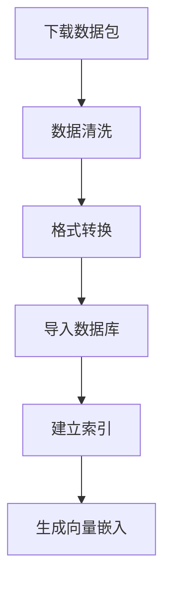
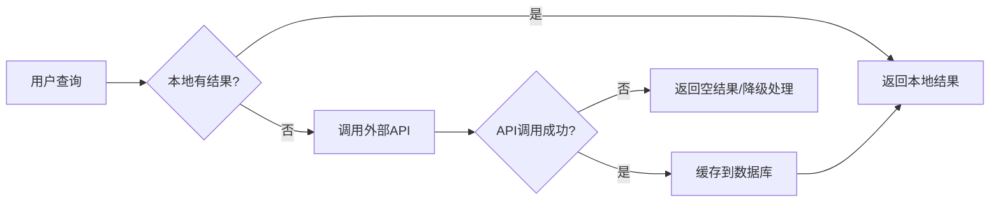

# 数据源策略文档

## 概述

本项目采用「核心开源数据 + 外部API补充」的双层数据源策略。

## 数据源分类

### 1. 核心开源数据（优先级：高）

#### 1.1 司法部法律法规公开平台
- **来源**：https://flk.npc.gov.cn/
- **数据类型**：法律法规文本
- **获取方式**：官方提供的批量下载包
- **优势**：
  - 数据权威准确
  - 更新及时
  - 无版权风险
- **导入策略**：
  - 定期（如每月）下载最新数据包
  - 完整导入到 `law_articles` 表
  - 作为本地法条数据的核心来源

#### 1.2 CAIL (中国法律智能技术评测)
- **来源**：http://www.cail.cipsc.org.cn/
- **数据类型**：200万+ 判决文书
- **特点**：
  - 已标注罪名、法条
  - 包含案件详情
  - 质量经过验证
- **导入策略**：
  - 导入典型案例到 `case_examples` 表
  - 用于案例分析和参考
  - 可按案件类型筛选导入

#### 1.3 LaWGPT 训练数据
- **来源**：https://github.com/ymcui/LaWGPT
- **数据类型**：法律问答对 + 法条数据
- **特点**：
  - 开源免费
  - 结构化程度高
  - 适用于AI训练
- **导入策略**：
  - 法条数据导入 `law_articles`
  - 问答对可用于构建FAQ库
  - 可提取常见法律问题模板

### 2. 外部API数据（优先级：补充）

#### 2.1 法律之星
- **价格**：1050元/年
- **配额**：
  - 5000次向量查询
  - 1000次正文请求
- **使用场景**：
  - 本地未收录的冷门法条
  - 向量相似度搜索（高级功能）
  - 法律解释和案例分析
- **调用策略**：
  - 仅在本地查询无结果时调用
  - 成功调用的结果缓存到数据库
  - 监控配额使用情况

#### 2.2 北大法宝
- **使用场景**：
  - 备用数据源
  - 特殊法律领域查询
- **调用策略**：
  - 作为法律之星的降级选项
  - 可根据需要启用/禁用

## 数据导入流程

### 阶段一：初始化导入（一次性）



**任务清单**：
- [ ] 下载司法部法律法规数据包
- [ ] 下载CAIL数据集
- [ ] 下载LaWGPT数据集
- [ ] 编写数据导入脚本
- [ ] 执行数据导入
- [ ] 建立全文搜索索引
- [ ] 生成向量嵌入（可选，用于语义搜索）

### 阶段二：定期更新（每月）

**更新频率**：
- 司法部数据：每月更新
- CAIL数据：每季度更新
- LaWGPT数据：按需更新

**更新策略**：
1. 对比新旧数据，识别新增/修改/失效的法条
2. 更新本地数据库
3. 标记失效法条（`status = EXPIRED`）
4. 清理冗余数据

### 阶段三：运行时补充（实时）



## 数据库设计调整

### law_articles 表（法条）

```prisma
model LawArticle {
  // ... 现有字段 ...
  
  // 新增字段
  dataSource   String       @default('local')  // 'local' | 'cail' | 'lawgpt' | 'lawstar' | 'pkulaw'
  sourceId     String?                        // 原始数据源ID
  importedAt   DateTime?                      // 导入时间
  lastSyncedAt DateTime?                      // 最后同步时间
  syncStatus   SyncStatus  @default('synced')  // 同步状态
}
```

### case_examples 表（案例）

```prisma
model CaseExample {
  // ... 现有字段 ...
  
  // 新增字段
  dataSource   String       @default('cail')  // 'cail' | 'local' | 'custom'
  sourceId     String?                        // CAIL案件ID
  importedAt   DateTime?
}
```

### external_cache 表（外部API缓存）

新增表，用于缓存外部API调用的结果：

```prisma
model ExternalCache {
  id          String   @id @default(cuid())
  source      String                    // 'lawstar' | 'pkulaw'
  query       String
  queryHash   String   @unique           // 查询哈希（用于去重）
  resultType  String                    // 'law_article' | 'case_example'
  resultData  Json                      // 缓存的结果数据
  hitCount    Int      @default(0)       // 命中次数
  expiresAt   DateTime                  // 过期时间
  createdAt   DateTime @default(now())
  lastAccessedAt DateTime?

  @@index([source])
  @@index([queryHash])
  @@index([expiresAt])
  @@index([hitCount])
  @@map("external_cache")
}
```

## 外部API调用策略

### 智能降级逻辑

```typescript
// 伪代码
async function searchLawArticles(query: string) {
  // 1. 查询本地数据库
  let results = await searchLocal(query);
  
  // 2. 如果本地结果不足，调用外部API
  if (results.length < 5) {
    try {
      const externalResults = await callLawStar(query);
      
      // 3. 缓存外部结果
      await cacheExternalResults(externalResults);
      
      // 4. 合并结果
      results = mergeResults(results, externalResults);
    } catch (error) {
      // 5. 降级到北大法宝
      const fallbackResults = await callPKULaw(query);
      results = mergeResults(results, fallbackResults);
    }
  }
  
  return results;
}
```

### 配额管理

```typescript
// 配额配置
const QUOTA_LIMITS = {
  lawstar: {
    vectorQuery: 5000,
    fullText: 1000,
    startDate: '2024-01-01',
  },
};

// 配额监控
async function checkQuota(source: string) {
  const usage = await getQuotaUsage(source);
  if (usage.remaining < 100) {
    sendAlert(`${source} 配额即将用尽`);
  }
}
```

## 数据导入脚本

### 司法部数据导入

```typescript
// scripts/import-judiciary-data.ts
interface JudiciaryData {
  lawName: string;
  articleNumber: string;
  content: string;
  category: string;
  effectiveDate: string;
}

async function importJudiciaryData(filePath: string) {
  const data = await readJSONFile(filePath);
  
  for (const item of data) {
    await prisma.lawArticle.upsert({
      where: {
        lawName_articleNumber: {
          lawName: item.lawName,
          articleNumber: item.articleNumber,
        },
      },
      update: {
        content: item.content,
        updatedAt: new Date(),
        lastSyncedAt: new Date(),
      },
      create: {
        ...item,
        dataSource: 'judiciary',
        importedAt: new Date(),
        status: 'VALID',
      },
    });
  }
}
```

### CAIL数据导入

```typescript
// scripts/import-cail-data.ts
interface CAILCase {
  case_id: string;
  case_name: string;
  case_type: string;
  facts: string;
  judgment: string;
  result: string;
  articles: Array<{
    law_name: string;
    article_number: string;
  }>;
}

async function importCAILCases(filePath: string) {
  const data = await readJSONFile(filePath);
  
  for (const item of data) {
    await prisma.caseExample.create({
      data: {
        title: item.case_name,
        caseNumber: item.case_id,
        type: item.case_type,
        facts: item.facts,
        judgment: item.judgment,
        result: item.result,
        dataSource: 'cail',
        sourceId: item.case_id,
        importedAt: new Date(),
      },
    });
  }
}
```

## 成本分析

### 初始成本

| 项目 | 金额 | 说明 |
|------|------|------|
| 司法部数据 | 免费 | 官方提供 |
| CAIL数据 | 免费 | 学术数据集 |
| LaWGPT数据 | 免费 | 开源项目 |
| 法律之星API | 1050元/年 | 可选 |
| **总计** | **1050元/年** | 仅API费用 |

### 运行成本

- 数据库存储：约10-50GB（取决于数据量）
- 外部API调用：按需使用
- 带宽费用：忽略不计

## 性能优化

### 1. 索引优化

```prisma
// 全文搜索索引
@@index([searchableText])

// 复合索引
@@index([category, status])
@@index([dataSource, lastSyncedAt])
```

### 2. 缓存策略

- Redis缓存热点法条
- 内存缓存查询结果（1小时）
- 外部API结果持久化缓存

### 3. 查询优化

- 使用PostgreSQL全文搜索
- 向量相似度搜索（可选）
- 分页加载，避免大数据集查询

## 监控与告警

### 监控指标

- 外部API调用次数
- 配额使用情况
- 缓存命中率
- 查询响应时间

### 告警规则

- 配额使用超过80%
- 外部API失败率超过10%
- 查询响应时间超过2秒

## 总结

本策略实现了：
1. **成本优化**：核心数据免费，仅少量API调用
2. **性能优化**：本地查询速度快，缓存命中率高
3. **数据质量**：使用权威开源数据
4. **可扩展性**：灵活添加新的数据源
5. **高可用性**：多层降级，保证服务稳定
