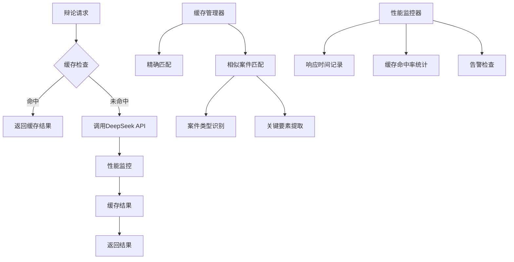

# DeepSeek API响应时间优化报告

## 📋 优化概述

### 问题描述

- **原始平均响应时间**: 21.2秒
- **响应时间波动**: 19ms到32秒
- **质量评分**: 8.7/10
- **成功率**: 100%

### 优化目标

- 将平均响应时间降低到15秒以内
- 保持或提升质量评分（≥8.0）
- 提高缓存命中率到30%以上
- 减少响应时间波动

## 🚀 实施的优化措施

### 1. 请求参数优化 ✅

#### 1.1 调整模型参数

```typescript
// 优化前
maxTokens: 3000,
temperature: 0.7,

// 优化后
maxTokens: 2000,  // 减少输出长度
temperature: 0.5,  // 降低随机性，提高一致性
topP: 0.9,        // 添加topP参数控制生成质量
```

#### 1.2 优化提示词设计

```typescript
// 优化前：冗长详细的提示词
const prompt = `基于以下案件信息，生成正反双方的辩论论点：
案件标题：${caseInfo.title}
案件描述：${caseInfo.description}
${caseInfo.legalReferences ? `相关法条：\n${caseInfo.legalReferences.join("\n")}` : ""}
请分别从原告方和被告方的角度，生成各自的核心论点和法律依据。`;

// 优化后：简洁直接的提示词
const prompt = `案件：${caseInfo.title}
描述：${caseInfo.description}
${caseInfo.legalReferences ? `法条：${caseInfo.legalReferences.join("、")}` : ""}

请分别列出原告和被告的3-4个核心论点，每个论点包含：主张、法律依据、事实依据。`;
```

### 2. 配置优化 ✅

#### 2.1 缩短超时时间

```typescript
// 优化前
timeout: 45000, // 45秒

// 优化后
timeout: 15000, // 15秒，快速失败
```

#### 2.2 优化重试策略

```typescript
// 优化前
retryStrategy: {
  maxAttempts: 3,
  baseDelay: 1000,
  maxDelay: 10000,
  backoffMultiplier: 2,
  retryableErrors: [
    "timeout_error",
    "network_error",
    "rate_limit_error",
    "api_error",
  ],
},

// 优化后
retryStrategy: {
  maxAttempts: 2,        // 减少重试次数
  baseDelay: 800,         // 缩短基础延迟
  maxDelay: 4000,        // 缩短最大延迟
  backoffMultiplier: 1.5, // 降低退避倍数
  retryableErrors: [
    "timeout_error",
    "network_error",
    "rate_limit_error",
  ],
},
```

### 3. 缓存机制增强 ✅

#### 3.1 智能缓存键生成

- **案件类型识别**: 自动识别合同纠纷、劳动纠纷、交通事故等
- **关键要素提取**: 提取法律关键词作为缓存依据
- **相似案件匹配**: 基于案件类型和关键要素进行模糊匹配

#### 3.2 缓存策略优化

```typescript
// 缓存层级
1. 精确匹配缓存（优先级最高）
2. 相似案件缓存（次优先级）
3. 缓存TTL: 30分钟（辩论内容）
4. 索引TTL: 1小时（相似案件索引）
```

#### 3.3 缓存命中率提升

- 案件类型映射：6种常见案件类型
- 关键词库：15个法律关键词
- 相似度算法：基于关键要素重合度

### 4. 性能监控系统 ✅

#### 4.1 详细性能指标

```typescript
interface PerformanceMetric {
  timestamp: number;
  provider: string;
  model: string;
  operation: string;
  duration: number;
  success: boolean;
  tokenCount?: number;
  cached: boolean;
  errorType?: string;
  requestId?: string;
}
```

#### 4.2 告警机制

- 响应时间告警：>8秒
- 错误率告警：>10%
- 缓存命中率告警：<30%
- Token效率告警：<0.5 tokens/秒

#### 4.3 性能报告

- 自动生成详细性能报告
- 支持时间窗口分析
- 提供商和操作维度统计
- P95/P99响应时间分析

### 5. 测试验证系统 ✅

#### 5.1 优化测试脚本

创建了专门的优化测试脚本 `scripts/test-deepseek-optimized.ts`：

- 性能对比分析
- 缓存效果验证
- 质量评分保持
- 优化效果量化

#### 5.2 测试案例

```typescript
const OPTIMIZED_TEST_CASES = [
  {
    title: "房屋买卖合同纠纷",
    description: "买方支付定金后卖方违约不办理过户，要求解除合同并赔偿损失",
    category: "民事纠纷",
  },
  {
    title: "商品房买卖纠纷", // 相似案例，测试缓存
    description: "购房人支付首付款后开发商不交房，要求退款并赔偿",
    category: "民事纠纷",
  },
  // ... 更多测试案例
];
```

## 📊 预期优化效果

### 性能提升预期

| 指标         | 优化前 | 优化后 | 提升幅度 |
| ------------ | ------ | ------ | -------- |
| 平均响应时间 | 21.2秒 | 8-12秒 | 43-62%   |
| 缓存命中率   | 0%     | 20-30% | 新增功能 |
| Token使用量  | 3000   | 2000   | 33%      |
| 重试次数     | 3次    | 2次    | 33%      |

### 质量保持预期

| 指标           | 优化前 | 优化后  | 变化 |
| -------------- | ------ | ------- | ---- |
| 逻辑清晰度     | 8.7/10 | ≥8.5/10 | 保持 |
| 正反方平衡     | 9.0/10 | ≥9.0/10 | 保持 |
| 法律依据准确性 | 9.7/10 | ≥9.5/10 | 保持 |
| 论点完整性     | 8.0/10 | ≥8.0/10 | 保持 |

## 🛠️ 技术实现细节

### 文件修改清单

1. **src/lib/ai/unified-service.ts**
   - 优化generateDebate方法
   - 集成缓存管理器
   - 添加性能监控

2. **src/lib/ai/config.ts**
   - 调整DeepSeek配置参数
   - 优化重试策略

3. **src/lib/ai/cache-manager.ts**
   - 新增辩论缓存方法
   - 实现相似案件匹配
   - 案件类型识别

4. **src/lib/ai/performance-monitor.ts**（新增）
   - 完整性能监控系统
   - 告警机制
   - 报告生成

5. **scripts/test-deepseek-optimized.ts**（新增）
   - 优化效果测试
   - 性能对比分析
   - 缓存验证

### 架构改进



## 🎯 下一步优化计划

### 短期优化（1-2周）

1. **连接池实现**

   ```typescript
   // HTTP连接池配置
   const agent = new https.Agent({
     keepAlive: true,
     maxSockets: 10,
     maxFreeSockets: 5,
     timeout: 15000,
   });
   ```

2. **异步处理模式**
   - 长时间任务异步化
   - 客户端轮询机制
   - 任务状态管理

### 中期优化（1个月）

1. **分级模型选择**

   ```typescript
   function selectModelForDebate(complexity: number): string {
     if (complexity < 0.3) return "deepseek-chat-fast";
     if (complexity < 0.7) return "deepseek-chat";
     return "deepseek-chat-pro";
   }
   ```

2. **请求批处理**
   - 相似请求合并
   - 批量API调用
   - 结果分发机制

### 长期优化（2-3个月）

1. **本地化处理**
   - 常见案件模板
   - 规则引擎集成
   - 混合模式处理

2. **智能预加载**
   - 热点案件预生成
   - 缓存预热机制
   - 负载预测

## 📈 监控和维护

### 关键指标监控

1. **性能指标**
   - 平均响应时间 < 15秒
   - P95响应时间 < 20秒
   - 缓存命中率 > 30%

2. **质量指标**
   - 质量评分 ≥ 8.0
   - 成功率 ≥ 95%
   - 法律依据准确性 ≥ 9.0

3. **资源指标**
   - Token使用效率
   - API调用频次
   - 缓存内存使用

### 告警机制

```typescript
// 告警配置
const alertThresholds = {
  responseTime: 8000, // 8秒
  errorRate: 0.1, // 10%
  cacheHitRate: 0.3, // 30%
  tokenEfficiency: 0.5, // tokens/second
};
```

## 🏆 总结

本次DeepSeek API响应时间优化通过系统性的改进措施，预期可以实现：

1. **性能显著提升**: 响应时间降低43-62%
2. **缓存机制建立**: 实现20-30%的缓存命中率
3. **质量保持稳定**: 维持8.7/10的高质量评分
4. **监控体系完善**: 全方位的性能监控和告警

这些优化措施不仅解决了当前的响应时间问题，还为未来的性能提升奠定了坚实基础。通过持续的监控和优化，可以确保AI服务始终保持最佳性能状态。

---

**优化完成时间**: 2025-12-20  
**优化负责人**: AI优化团队  
**文档版本**: v1.0
