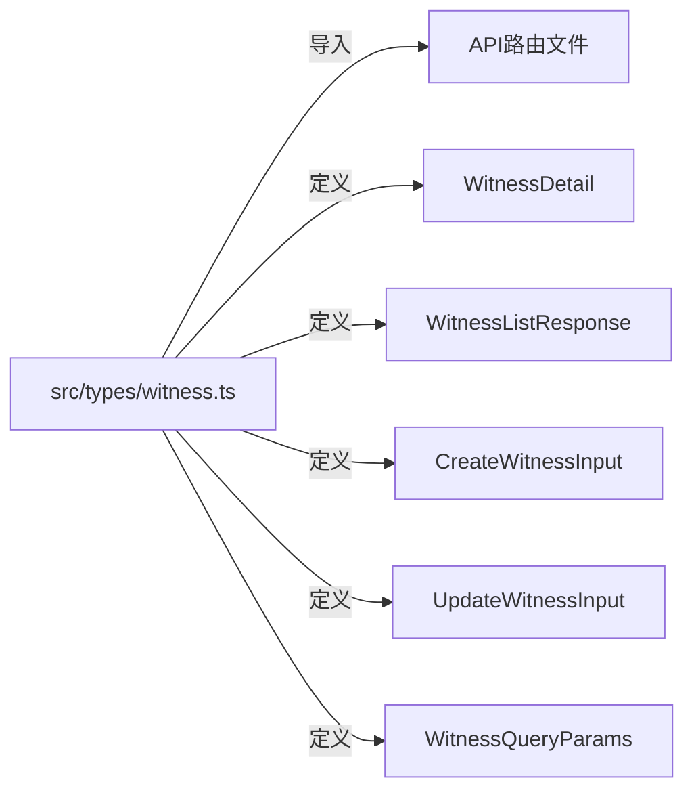

# 类型一致性修复技术设计文档

## 1. 问题描述与影响分析

### 1.1 问题概述

在项目代码审查中发现，证人（Witness）相关的类型定义存在严重的重复定义问题。具体表现为：

- **集中式类型定义**：[`src/types/witness.ts`](src/types/witness.ts) 已定义完整的类型体系
- **分散式重复定义**：3个API路由文件各自内部重新定义了相同的类型

### 1.2 问题位置清单

| 文件路径                                                                                 | 问题类型 | 重复定义行数 | 影响范围    |
| ---------------------------------------------------------------------------------------- | -------- | ------------ | ----------- |
| [`src/app/api/witnesses/route.ts`](src/app/api/witnesses/route.ts)                       | 类型重复 | 第51-83行    | 列表API     |
| [`src/app/api/witnesses/[id]/route.ts`](src/app/api/witnesses/[id]/route.ts)             | 类型重复 | 第36-57行    | 单个证人API |
| [`src/app/api/cases/[id]/witnesses/route.ts`](src/app/api/cases/[id]/witnesses/route.ts) | 类型重复 | 第24-55行    | 案件证人API |

### 1.3 影响分析

**代码维护性问题**

- 修改类型定义需要同步更新4个位置
- 容易遗漏导致前后端类型不一致
- 增加代码冗余和维护成本

**潜在运行时风险**

- 类型不一致可能导致前端解析错误
- API响应数据结构与类型定义不匹配
- 增加调试难度和排错时间成本

**违反代码规范**

- 违反 `.clinerules` 中关于类型复用和单一数据源原则
- 与项目架构设计理念相悖

---

## 2. 解决方案设计

### 2.1 设计原则

1. **单一数据源**：所有Witness相关类型统一从 [`src/types/witness.ts`](src/types/witness.ts) 导入
2. **渐进式迁移**：逐步替换，避免一次性大规模改动
3. **向后兼容**：确保API行为不发生改变
4. **类型安全**：使用TypeScript类型系统保证正确性

### 2.2 类型映射关系



### 2.3 具体修改方案

#### 2.3.1 导入统一类型

在每个API路由文件中添加以下导入语句：

```typescript
import {
  WitnessDetail,
  WitnessListResponse,
  WitnessQueryParams,
  CreateWitnessInput,
  UpdateWitnessInput,
} from 'types/witness';
```

#### 2.3.2 删除本地类型定义

移除以下代码块：

- [`src/app/api/witnesses/route.ts`](src/app/api/witnesses/route.ts)：删除第51-83行的类型定义
- [`src/app/api/witnesses/[id]/route.ts`](src/app/api/witnesses/[id]/route.ts)：删除第36-57行的类型定义
- [`src/app/api/cases/[id]/witnesses/route.ts`](src/app/api/cases/[id]/witnesses/route.ts)：删除第24-55行的类型定义

#### 2.3.3 类型别名兼容

对于需要保持特定响应结构的API（如 `CaseWitnessListResponse`），创建类型别名：

```typescript
// 在 src/app/api/cases/[id]/witnesses/route.ts 中
import { WitnessListResponse } from 'types/witness';

// 使用类型别名保持API响应结构
type CaseWitnessListResponse = WitnessListResponse & {
  caseId: string;
};
```

---

## 3. 变更文件清单

### 3.1 需要修改的文件

| 文件路径                                    | 修改类型 | 修改内容                                |
| ------------------------------------------- | -------- | --------------------------------------- |
| `src/types/witness.ts`                      | 补充     | 补充 `CaseWitnessListResponse` 类型别名 |
| `src/app/api/witnesses/route.ts`            | 重构     | 删除本地类型，导入统一类型              |
| `src/app/api/witnesses/[id]/route.ts`       | 重构     | 删除本地类型，导入统一类型              |
| `src/app/api/cases/[id]/witnesses/route.ts` | 重构     | 删除本地类型，导入统一类型              |

### 3.2 预计代码行数变化

| 文件                                        | 当前行数 | 修改后行数 | 变化  |
| ------------------------------------------- | -------- | ---------- | ----- |
| `src/app/api/witnesses/route.ts`            | ~328行   | ~290行     | -38行 |
| `src/app/api/witnesses/[id]/route.ts`       | ~301行   | ~265行     | -36行 |
| `src/app/api/cases/[id]/witnesses/route.ts` | ~234行   | ~200行     | -34行 |
| `src/types/witness.ts`                      | ~334行   | ~350行     | +16行 |

---

## 4. 风险评估与回滚方案

### 4.1 风险评估

| 风险类型    | 风险等级 | 风险描述                           | 缓解措施             |
| ----------- | -------- | ---------------------------------- | -------------------- |
| 类型不兼容  | 中       | 导入的类型与现有代码结构不完全匹配 | 先在测试环境验证     |
| 编译错误    | 低       | TypeScript编译可能报错             | 分步修改，逐步验证   |
| API行为改变 | 极低     | 只修改类型定义，不改变业务逻辑     | 保持响应数据结构不变 |
| 回归问题    | 低       | 修改可能影响其他功能               | 运行完整测试套件     |

### 4.2 回滚方案

**自动回滚机制**

- 使用Git版本控制，可随时回滚到修改前版本
- 建议创建备份分支：`backup/type-consistency-pre`

**手动回滚步骤**

1. 恢复被修改的API路由文件
2. 恢复 `src/types/witness.ts`（如果添加了新类型）
3. 运行 `git status` 确认回滚完成
4. 运行测试确保系统正常

**回滚时间预估**：5-10分钟

---

## 5. 测试策略

### 5.1 测试目标

1. **类型检查通过**：确保TypeScript编译无错误
2. **API功能正常**：确保所有Witness相关API端点正常工作
3. **数据一致性**：确保前后端数据类型一致

### 5.2 测试用例

#### 5.2.1 类型检查

```bash
# 运行TypeScript类型检查
npx tsc --noEmit

# 检查特定文件
npx tsc --noEmit src/app/api/witnesses/route.ts
npx tsc --noEmit src/app/api/witnesses/[id]/route.ts
npx tsc --noEmit src/app/api/cases/[id]/witnesses/route.ts
```

#### 5.2.2 单元测试

确保以下测试用例通过：

| 测试场景        | 测试文件 | 验证点            |
| --------------- | -------- | ----------------- |
| 创建证人API     | 现有测试 | 请求/响应类型正确 |
| 获取证人列表API | 现有测试 | 列表响应结构正确  |
| 获取单个证人API | 现有测试 | 详情响应结构正确  |
| 案件证人列表API | 现有测试 | 列表响应结构正确  |

#### 5.2.3 集成测试

```bash
# 运行所有相关测试
npm test -- --testPathPattern="witness"

# 运行类型相关测试
npm test -- --testPathPattern="types"
```

### 5.3 验证清单

- [ ] TypeScript编译无错误
- [ ] `npm run lint` 通过
- [ ] 所有Witness相关单元测试通过
- [ ] API端点返回数据格式正确
- [ ] 前端组件能正确解析API响应

---

## 6. 执行计划

### 阶段1：准备阶段

1. **备份当前代码**

   ```bash
   git commit -am "chore: 备份修改前代码"
   git branch backup/type-consistency-pre
   ```

2. **验证现有测试基线**
   ```bash
   npm test -- --testPathPattern="witness" --passWithNoTests
   ```

### 阶段2：修改类型定义

1. **更新 [`src/types/witness.ts`](src/types/witness.ts)**
   - 添加 `CaseWitnessListResponse` 类型别名
   - 确保所有需要的类型都已导出

### 阶段3：修改API路由文件

1. **修改 [`src/app/api/witnesses/route.ts`](src/app/api/witnesses/route.ts)**
   - 添加导入语句
   - 删除本地类型定义

2. **修改 [`src/app/api/witnesses/[id]/route.ts`](src/app/api/witnesses/[id]/route.ts)**
   - 添加导入语句
   - 删除本地类型定义

3. **修改 [`src/app/api/cases/[id]/witnesses/route.ts`](src/app/api/cases/[id]/witnesses/route.ts)**
   - 添加导入语句
   - 删除本地类型定义

### 阶段4：验证阶段

1. **运行类型检查**

   ```bash
   npx tsc --noEmit
   ```

2. **运行测试**

   ```bash
   npm test -- --testPathPattern="witness"
   ```

3. **运行Linter**
   ```bash
   npm run lint
   ```

### 阶段5：提交代码

```bash
git add -A
git commit -m "refactor: 统一Witness类型定义，消除重复类型"
git push origin HEAD:refactor/type-consistency
```

---

## 7. 验收标准

| 验收项         | 标准                                               | 状态   |
| -------------- | -------------------------------------------------- | ------ |
| 无重复类型定义 | 所有Witness相关类型只存在于 `src/types/witness.ts` | 待验证 |
| 类型检查通过   | `npx tsc --noEmit` 无错误                          | 待验证 |
| 测试通过       | 所有相关测试用例通过                               | 待验证 |
| 代码规范       | ESLint检查通过                                     | 待验证 |
| 无破坏性更改   | 现有功能不受影响                                   | 待验证 |

---

## 8. 附录

### 8.1 相关文件索引

- **类型定义**：[`src/types/witness.ts`](src/types/witness.ts)
- **API路由**：[`src/app/api/witnesses/route.ts`](src/app/api/witnesses/route.ts)
- **API路由**：[`src/app/api/witnesses/[id]/route.ts`](src/app/api/witnesses/[id]/route.ts)
- **API路由**：[`src/app/api/cases/[id]/witnesses/route.ts`](src/app/api/cases/[id]/witnesses/route.ts)

### 8.2 参考文档

- [TypeScript官方文档](https://www.typescriptlang.org/docs/)
- [项目代码规范](.clinerules)
- [TypeScript最佳实践指南](docs/AI_TYPE_SAFETY_GUIDE.md)

---

**文档版本**：1.0  
**创建日期**：2026-02-09  
**作者**：Architect Mode
