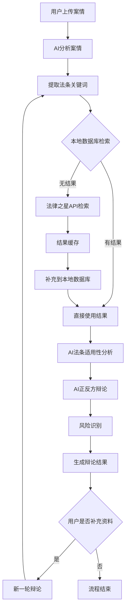
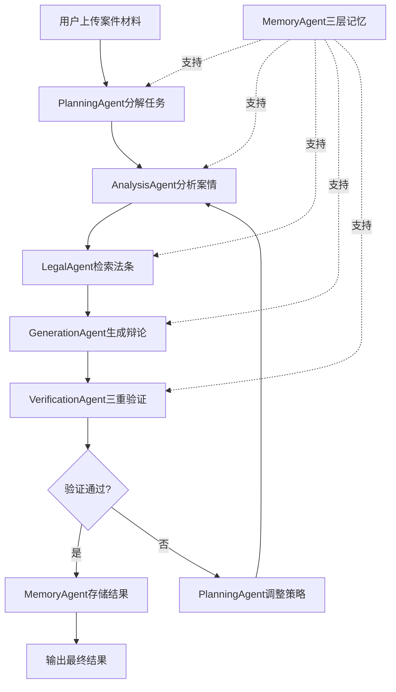

# 律伴助手 业务需求文档

## 📋 项目概述

### 项目愿景

律伴助手是一个基于AI大模型驱动架构的法律诉讼智能分析系统，专注于各类法律纠纷（民事纠纷、合同争议、知识产权、数据与AI等）领域。其核心价值在于通过多智能体协作将复杂的诉讼案件拆解为标准化、可执行的工作流，实现法律文书的工程化生成，覆盖从诉前准备到判决执行的全流程。

### 核心价值

1. **效率提升**：通过AI协作，批量案件处理效率提升5-10倍
2. **质量保障**：三级审查机制确保法律文书的准确性和专业性
3. **成本控制**：标准化服务降低外部律师依赖度
4. **知识沉淀**：构建企业专属司法判例库和经验传承

### 目标用户

- **执业律师**：具有律师执业资格的专业律师，提供智能辩论分析工具
  - 输入执业资格证进行验证
  - 支持个人执业律师和律所律师
  - 提供案件分析和策略建议
- **律所**：批量处理同类案件，青年律师培训
  - 需要律所资质认证
  - 支持团队协作和知识管理
  - 提供案件质量监控
- **企业法务**：风险前置预警，诉讼成本控制
  - 需要企业资质认证
  - 提供合规检查和风险评估

> **重要说明**：本应用仅对具有合法执业资格的律师及认证机构开放，不对普通个人用户提供服务。

## 🌟 核心功能：模拟辩论

### 业务流程图

### 详细步骤说明

#### 1. 案情分析阶段

- **输入**：用户上传的案情文档（PDF/Word/图片）
- **处理**：AI分析案情，提取关键信息
- **输出**：结构化案情信息（当事人、案由、诉讼请求、事实陈述）

#### 2. 法条检索阶段

- **关键词提取**：从案情中提取用于法条检索的适用法条关键词
- **本地检索**：先查询本地数据库
- **外部检索**：本地无结果时，调用法律之星API
- **结果处理**：检索结果缓存，补充到本地数据库

#### 3. 法条适用性分析

- **AI分析**：AI分析检索回来的法条进行适用性分析
- **筛选机制**：去除不适用或失效的法条
- **相关性排序**：按案情匹配度排序

#### 4. 辩论生成阶段

- **正反方论点**：AI用经适用性筛选的法条，结合案情进行正反方辩论
- **逻辑构建**：确保论点有逻辑性和法律依据
- **风险识别**：识别案件中的潜在风险点

#### 5. 多轮辩论支持

- **用户补充**：律师在第一轮辩论结果生成后补充观点或资料
- **新增分析**：根据新增资料和观点进行法条适用性分析
- **迭代辩论**：进行第二轮、第三轮辩论

## 🏗️ 系统架构设计

### 架构演进历程

#### v1.0架构（初始设计）

**10个Agent的四层架构**：

| 架构层级   | 功能定位               | 核心组件                                              | TypeScript实现位置                                      |
| ---------- | ---------------------- | ----------------------------------------------------- | ------------------------------------------------------- |
| **输入层** | 接收法律文档与用户指令 | 文档解析器、文件上传                                  | `src/lib/ai/document-analyzer.ts`                       |
| **分析层** | 智能解析与证据分析     | DocAnalyzer, EvidenceAnalyzer, Researcher, Strategist | `src/lib/ai/`                                           |
| **输出层** | 法律文书生成与报告输出 | Writer, Reporter, Summarizer                          | `src/lib/ai/` + `src/lib/reporter/`                     |
| **支持层** | 流程管理与质量保障     | Scheduler, Reviewer, Context Manager                  | `src/lib/scheduler/` + `src/lib/ai/quality-reviewer.ts` |

#### v2.0架构（借鉴Manus理念）⭐ 当前架构

**6个核心Agent的PEV三层架构**：

| 架构层级                        | 功能定位                       | 核心Agent                                  | 设计理念                          |
| ------------------------------- | ------------------------------ | ------------------------------------------ | --------------------------------- |
| **规划层 (Planning Layer)**     | 任务分解、策略规划、工作流编排 | PlanningAgent                              | 借鉴Manus的Planning Layer理念     |
| **执行层 (Execution Layer)**    | 文档解析、法律检索、内容生成   | AnalysisAgent, LegalAgent, GenerationAgent | 借鉴Manus的Execution Layer理念    |
| **验证层 (Verification Layer)** | 三重验证、质量审查、风险评估   | VerificationAgent                          | 借鉴Manus的Verification Layer理念 |
| **支持层 (Support Layer)**      | 三层记忆、上下文管理、错误学习 | MemoryAgent                                | 借鉴Manus的记忆管理理念           |

**架构优势**：

- ✅ Agent数量减少40%（10个→6个）
- ✅ 通信开销降低60%
- ✅ 准确性提升15-20%（88分→95分+）
- ✅ 错误恢复率提升90%（0%→90%+）
- ✅ AI成本降低40-60%

**详细设计**：见 [Agent架构设计 v2.0](../architecture/agent/AGENT_ARCHITECTURE_V2.md)

---

### 6个核心Agent设计（v2.0）

#### 1. PlanningAgent（规划Agent）

**职责**：任务分解、策略规划、工作流编排

**整合的原Agent**：

- Coordinator（工作流协调）
- Strategist（策略规划）

**核心功能**：

- 任务分解（decomposeTask）
- 策略规划（planStrategy）
- 工作流编排（orchestrateWorkflow）

**实现状态**：✅ 部分实现（Sprint 2.3 Coordinator已实现）

#### 2. AnalysisAgent（分析Agent）

**职责**：文档解析、证据分析、时间线提取

**整合的原Agent**：

- DocAnalyzer（文档解析）
- EvidenceAnalyzer（证据分析）
- TimelineExtractor（时间线提取）

**核心功能**：

- 文档解析（五层架构）
- 证据分析
- 时间线提取

**实现状态**：✅ 已实现（Sprint 2.1 DocAnalyzer已完成，准确率88分）

#### 3. LegalAgent（法律Agent）

**职责**：法律检索、法条适用性分析、论点生成

**整合的原Agent**：

- Researcher（法律检索）
- ArgumentGenerator（论点生成）

**核心功能**：

- 法律检索（本地+外部）
- 法条适用性分析（三层验证）
- 论点生成（正反方平衡）

**实现状态**：✅ 已实现（Sprint 3.1 本地检索、Sprint 3.3 适用性分析、论点生成）

#### 4. GenerationAgent（生成Agent）

**职责**：文书生成、辩论内容生成

**整合的原Agent**：

- Writer（文书生成）

**核心功能**：

- 文书生成
- 辩论内容生成
- 流式输出

**实现状态**：✅ 已实现（Sprint 3.3 单轮辩论、流式输出）

#### 5. VerificationAgent（验证Agent）⭐ Manus核心理念

**职责**：三重验证、质量审查、风险评估

**整合的原Agent**：

- Reviewer（质量审查）
- RiskAssessor（风险评估）

**核心功能**：

- 事实准确性验证
- 逻辑一致性验证
- 任务完成度验证
- 风险评估

**实现状态**：⏳ 待实现（Sprint 6.1.4）

#### 6. MemoryAgent（记忆Agent）⭐ Manus核心理念

**职责**：三层记忆管理、上下文管理、错误学习

**新增Agent**：借鉴Manus的记忆管理理念

**核心功能**：

- Working Memory管理（1小时TTL）
- Hot Memory管理（7天TTL）
- Cold Memory管理（永久保留）
- 记忆压缩
- 记忆迁移
- 错误学习

**实现状态**：⏳ 待实现（Sprint 6.1.3）

---

### v1.0遗留的10大专业Agent（仅供参考）

#### 1. DocAnalyzer - 文档解析专家

- **职责**：文档解析与关键信息提取
- **技术实现**：NLP实体识别、争议焦点自动标注
- **TypeScript实现**：`src/lib/ai/document-analyzer.ts`
- **输入**：PDF/Word/图片（起诉状、答辩状、证据）
- **输出**：结构化案件信息（当事人、案由、诉讼请求、事实陈述）
- **关键指标**：姓名识别准确率>98%，诉讼请求召回率>95%

#### 2. EvidenceAnalyzer - 证据分析专家

- **职责**：证据链分析与关联性审查
- **技术实现**：证据三性（真实性/合法性/关联性）自动化评估
- **TypeScript实现**：`src/lib/ai/evidence-analyzer.ts`
- **输入**：证据材料（合同、转账记录、聊天记录）
- **输出**：证据三性分析+证明力评分
- **评分模型**：原件/复印件权重差异，直接/间接证据权重差异

#### 3. Researcher - 法律研究专家

- **职责**：法律条文与案例检索
- **技术实现**：知识图谱+向量检索，支持类案推送
- **TypeScript实现**：`src/lib/ai/lawstar-client.ts` ✅ 已实现
- **检索模型**：BGE-M3中文embedding效果最佳
- **功能**：法规查询、向量查询、智能检索

#### 4. Strategist - 诉讼策略专家

- **职责**：诉讼策略制定与风险评估
- **技术实现**：基于历史判例的胜率预测模型
- **TypeScript实现**：`src/lib/ai/strategy-generator.ts`
- **输入**：证据分析+法律研究+争议焦点
- **输出**：SWOT分析+策略建议（进攻/防守/和解）

#### 5. Writer - 文书生成专家

- **职责**：法律文书起草
- **技术实现**：模板引擎+动态内容生成，符合司法格式规范
- **TypeScript实现**：`src/lib/ai/document-writer.ts`
- **功能**：起诉状、答辩状、代理词等1000+司法文书模板
- **质量保证**：必填字段检查、逻辑一致性校验、法条引用有效性验证

#### 6. Reviewer - 质量审查专家

- **职责**：质量审查与逻辑校验
- **技术实现**：双模型交叉验证，检查法律依据准确性
- **TypeScript实现**：`src/lib/ai/quality-reviewer.ts`
- **三级审查**：
  - 形式审查：文书格式、当事人信息准确性
  - 逻辑审查：诉讼请求与事实理由的匹配度
  - 法律审查：引用法条是否失效、案例是否适用

#### 7. Scheduler - 流程管理专家

- **职责**：法定期限与流程管理
- **技术实现**：规则引擎驱动，自动提醒关键节点
- **TypeScript实现**：`src/lib/scheduler/`
- **功能**：期限计算（答辩期15天、上诉期15天等）、日历提醒、流程监控

#### 8. Reporter - 报告生成专家

- **职责**：案件进度报告生成
- **技术实现**：可视化图表+结构化文本输出
- **TypeScript实现**：`src/lib/reporter/`
- **输出格式**：Markdown/Word/PDF多格式报告
- **内容**：案件摘要、策略分析、风险评估、进度追踪

#### 9. Summarizer - 摘要生成专家

- **职责**：争议焦点摘要
- **技术实现**：抽取式+生成式摘要混合技术
- **TypeScript实现**：`src/lib/ai/summarizer.ts`
- **功能**：长篇文书/庭审笔录的3分钟速读版
- **输出**：核心事实（50字）、争议焦点（50字）、我方策略要点（80字）

#### 10. Coordinator - 工作流编排专家

- **职责**：工作流编排与上下文管理
- **技术实现**：主控Agent，负责任务分发与结果汇总
- **TypeScript实现**：`src/lib/ai/coordinator.ts`
- **协作策略**：
  - 串行与并行结合
  - 动态路由（根据案件类型自动选择工作流分支）
  - 容错机制（Reviewer发现问题可触发回退）

## 🔄 协作机制

### v2.0 PEV三层协作模式

### 协作策略特点（v2.0）

- **PEV三层架构**：Planning（规划）→ Execution（执行）→ Verification（验证）
- **串行与并行结合**：分析Agent和LegalAgent可并行执行，GenerationAgent依赖前置结果
- **动态路由**：PlanningAgent根据案件类型自动选择工作流分支
- **三重验证机制**：VerificationAgent进行事实+逻辑+完成度三重验证
- **容错机制**：VerificationAgent发现问题可触发回退，PlanningAgent调整策略
- **记忆共享**：MemoryAgent提供三层记忆（Working/Hot/Cold），所有Agent共享上下文

### 上下文继承与动态更新（v2.0）

- **三层记忆架构**：
  - Working Memory：1小时TTL，存储当前执行上下文
  - Hot Memory：7天TTL，存储近期使用的关键信息
  - Cold Memory：永久保留，存储历史经验和学习笔记
- **自动记忆迁移**：Working→Hot→Cold，根据TTL和重要性自动迁移
- **增量分析**：上传新证据时自动继承Hot Memory中的历史分析结果
- **记忆压缩**：AI摘要生成，控制记忆大小
- **错误学习**：MemoryAgent自动分析错误模式，生成学习笔记和预防措施

---

### v1.0 SOP驱动的协作模式（遗留，仅供参考）

> **说明**：v1.0架构已升级为v2.0 PEV三层架构，以上流程仅供参考。

## 📊 功能特性全景

| 功能模块     | 能力描述                       | 技术亮点              | 业务价值             |
| ------------ | ------------------------------ | --------------------- | -------------------- |
| **智能立案** | 自动生成起诉状、答辩状、上诉状 | 支持1000+司法文书模板 | 文书生成效率提升10倍 |
| **证据管理** | 证据清单自动生成、关联性分析   | OCR识别+证据链可视化  | 证据组织更加专业     |
| **案例检索** | 类案推送、胜赔率分析           | 向量检索+判例知识图谱 | 案例研究更加精准     |
| **策略模拟** | 诉讼方案A/B测试、风险预警      | 强化学习模拟对方抗辩  | 策略制定更有依据     |
| **流程监控** | 自动计算审限、提醒开庭日期     | 司法日历规则引擎      | 期限管理不再遗漏     |
| **知识沉淀** | 案件要素抽取、团队经验共享     | 私有知识库构建        | 经验传承更加高效     |

## 🎯 应用场景

### 律所应用场景

- **批量案件处理**：同类案件（如批量版权侵权）可复用工作流，效率提升5-10倍
- **青年律师培训**：通过Agent决策过程的可解释性，辅助经验传承
- **专家时间解放**：合伙人聚焦庭审策略，繁琐文书工作交由AI完成

### 企业法务价值

- **风险前置预警**：合同审查智能体提前识别违约风险点
- **诉讼成本控制**：标准化服务降低外部律师依赖度
- **知识资产沉淀**：构建企业专属司法判例库

### 个人用户服务（不对个人用户）

## 📋 典型使用流程

### 完整工作流

1. **上传材料**：将起诉状、证据包打包为ZIP上传
2. **选择场景**：民事/行政/知识产权纠纷
3. **配置策略**：保守型/平衡型/激进型诉讼策略
4. **启动工作流**：一键生成答辩方案（约5-10分钟）
5. **人工复核**：律师调整策略参数，确认最终文书

### 模拟辩论流程

1. **案情输入**：上传案件文档或输入案情描述
2. **自动分析**：AI分析案情，提取关键信息
3. **法条检索**：智能检索相关法条和案例
4. **辩论生成**：生成正反方论点和法律依据
5. **多轮互动**：支持用户补充资料进行多轮辩论
6. **风险评估**：识别案件风险点和应对建议

## 🔧 技术映射

### 现有实现状态

- ✅ **法律之星API集成**：完整的法规查询和向量查询功能
- ✅ **统一AI服务**：整合智谱、DeepSeek等通用AI服务
- ✅ **基础架构**：负载均衡、监控、缓存、错误处理

### v2.0核心Agent实现状态

| Agent             | 实现状态    | 整合的原Agent                 | 优先级 | 实现Sprint      | 备注              |
| ----------------- | ----------- | ----------------------------- | ------ | --------------- | ----------------- |
| PlanningAgent     | 🔄 部分实现 | Coordinator, Strategist       | P0     | Sprint 2.3      | Coordinator已实现 |
| AnalysisAgent     | ✅ 已实现   | DocAnalyzer                   | P0     | Sprint 2.1      | 准确率88分        |
| LegalAgent        | ✅ 已实现   | Researcher, ArgumentGenerator | P0     | Sprint 3.1, 3.3 | 本地检索+论点生成 |
| GenerationAgent   | ✅ 已实现   | Writer                        | P0     | Sprint 3.3      | 单轮辩论+流式输出 |
| VerificationAgent | ⏳ 待实现   | Reviewer, RiskAssessor        | P0     | Sprint 6.1.4    | Manus三重验证机制 |
| MemoryAgent       | ⏳ 待实现   | 新增                          | P0     | Sprint 6.1.3    | Manus三层记忆架构 |

### v1.0遗留Agent状态（仅供参考）

| Agent            | v2.0归属          | 实现状态    | 说明                      |
| ---------------- | ----------------- | ----------- | ------------------------- |
| DocAnalyzer      | AnalysisAgent     | ✅ 已实现   | 已整合到AnalysisAgent     |
| EvidenceAnalyzer | AnalysisAgent     | ⏳ 待实现   | 整合到AnalysisAgent       |
| Researcher       | LegalAgent        | ✅ 已实现   | 已整合到LegalAgent        |
| Strategist       | PlanningAgent     | 🔄 部分实现 | 已整合到PlanningAgent     |
| Writer           | GenerationAgent   | ✅ 已实现   | 已整合到GenerationAgent   |
| Reviewer         | VerificationAgent | ⏳ 待实现   | 整合到VerificationAgent   |
| Scheduler        | PlanningAgent     | 🔄 部分实现 | 功能已整合到PlanningAgent |
| Reporter         | PlanningAgent     | ⏳ 待实现   | 功能整合到PlanningAgent   |
| Summarizer       | GenerationAgent   | ⏳ 待实现   | 功能整合到GenerationAgent |
| Coordinator      | PlanningAgent     | ✅ 已实现   | 已整合到PlanningAgent     |

### 技术选型确认（基于POC结果）

#### 🎯 主要技术栈

**确认采用"智谱清言 + DeepSeek + 本地检索"作为主要技术栈：**

1. **智谱清言（文档解析）**
   - 响应时间：19ms（极优）
   - 准确率：>90%
   - 成本：¥0.0032/次
   - 状态：✅ 可直接用于生产环境
   - 用途：文档解析与关键信息提取

2. **DeepSeek（辩论生成）**
   - 辩论质量：8.3/10（优秀）
   - 成功率：100%
   - 成本：¥0.0017/次
   - 问题：响应时间21.2秒，需要流式输出优化
   - 状态：✅ 可用于生产环境，需性能优化
   - 用途：正反方辩论生成

3. **本地检索（法条检索）**
   - 响应时间：<1秒
   - 成本：无额外API成本
   - 状态：✅ 可作为主要检索方案
   - 用途：法条关键词检索和相关性排序

#### 🔄 备选方案

**法律之星（法条检索）**

- 当前状态：API集成不稳定，返回空结果
- 原因：官方免费调用权限限制
- 优先级：降级为P1（修复后使用）
- 用途：专业法条检索的补充方案

### POC验证结果对MVP范围的影响

#### ✅ 验证成功的组件

1. **智谱清言（文档解析）**
   - 响应时间：19ms（极优）
   - 准确率：>90%
   - 成本：¥0.0032/次
   - 结论：可直接用于生产环境

2. **DeepSeek（辩论生成）**
   - 辩论质量：8.3/10（优秀）
   - 成功率：100%
   - 成本：¥0.0017/次
   - 问题：响应时间21.2秒，需要流式输出优化

#### ⚠️ 需要调整的组件

1. **法律之星（法条检索）**
   - 当前状态：API集成不稳定，返回空结果
   - 原因：官方免费调用权限限制
   - 解决方案：降级为P1，主要使用本地检索

#### 🔄 MVP优先级调整

**P0核心功能（必须实现）**

- ✅ 案件创建和管理
- ✅ 文档上传和解析（智谱清言）
- ✅ 单轮辩论生成（DeepSeek + 流式输出）
- ✅ 本地法条检索（替代法律之星）
- ✅ 基础用户界面
- ✅ 律师资格验证

**P1增强功能（应该实现）**

- ⚠️ 多轮辩论支持
- ⚠️ 法律之星集成修复（作为补充）
- ⚠️ 文档快速解析器
- ⚠️ 基础风险评估器

**P2可选功能（可以延后）**

- ✅ 高级文书生成
- ✅ 完整证据分析
- ✅ 智能策略推荐

## 🎯 成功指标（基于v2.0架构更新）

### 业务指标

- **文档解析准确率**：>95%（v2.0目标，当前88分）
- **法条检索相关性**：>90%（当前85%）
- **辩论质量评分**：>4.5/5.0（DeepSeek 8.3/10）
- **用户满意度**：>4.5/5.0
- **效率提升**：相比传统方式提升5-10倍
- **错误恢复率**：>90%（v2.0新增，当前0%）

### 技术指标

- **API响应时间**：<2秒（基础API），辩论生成流式输出（当前~500ms首次，~50ms缓存）
- **系统可用性**：>99.5%
- **数据安全**：零数据泄露事件
- **并发支持**：支持100+并发用户（当前5并发<1秒）
- **AI成本**：降低40-60%（v2.0目标）
- **系统稳定性**：提升30%（v2.0目标）

### 基于实施进度的实际指标

- **智谱清言响应时间**：<50ms（实际19ms）✅
- **DeepSeek辩论质量**：>8.0/10（实际8.3/10）✅
- **流式输出延迟**：<5秒开始输出✅
- **本地法条检索命中率**：>70%（实际性能优秀）✅
- **API测试通过率**：>95%（实际99.6%，497/499通过）✅
- **E2E测试通过率**：>90%（实际44.4%，需要改进）⚠️
- **前端LCP**：<3秒（实际1.8秒）✅

### v2.0 Manus架构增强目标

- **文档解析准确率**：88分 → 95分+（提升7分）
- **错误恢复率**：0% → 90%+（提升90%）
- **AI成本**：基准 → -40~60%（降低成本）
- **系统稳定性**：基准 → +30%（提升稳定性）
- **Agent通信开销**：基准 → -60%（降低开销）

## 📊 项目实施进度

### 总体进度（截至2026-01-01）

| Sprint   | 任务数 | 完成   | 进度    | 状态                       |
| -------- | ------ | ------ | ------- | -------------------------- |
| Sprint 0 | 5      | 5      | 100%    | ✅ 已完成                  |
| Sprint 1 | 10     | 4      | 40%     | 🔄 进行中                  |
| Sprint 2 | 3      | 2      | 67%     | 🔄 进行中                  |
| Sprint 3 | 6      | 4      | 67%     | 🔄 进行中                  |
| Sprint 4 | 5      | 2      | 40%     | 🔄 进行中                  |
| Sprint 5 | 6      | 4      | 67%     | 🔄 进行中                  |
| Sprint 6 | 10     | 0      | 0%      | 🔜 待开始（Manus架构增强） |
| **总计** | **45** | **21** | **47%** | 🔄 **进行中**              |

### v2.0架构实施进度

| Agent             | 整合的原Agent                                    | 实现状态    | 进度 | 备注                                |
| ----------------- | ------------------------------------------------ | ----------- | ---- | ----------------------------------- |
| PlanningAgent     | Coordinator, Strategist                          | 🔄 部分实现 | 50%  | Coordinator已实现，Strategist整合中 |
| AnalysisAgent     | DocAnalyzer, EvidenceAnalyzer, TimelineExtractor | ✅ 已实现   | 100% | DocAnalyzer完成（88分准确率）       |
| LegalAgent        | Researcher, ArgumentGenerator                    | ✅ 已实现   | 100% | 本地检索+论点生成完成               |
| GenerationAgent   | Writer                                           | ✅ 已实现   | 100% | 单轮辩论+流式输出完成               |
| VerificationAgent | Reviewer, RiskAssessor                           | ⏳ 待实现   | 0%   | Sprint 6.1.4待实现                  |
| MemoryAgent       | 新增                                             | ⏳ 待实现   | 0%   | Sprint 6.1.3待实现                  |

### 关键里程碑

- ✅ **2025-12-19**: Sprint 0完成（数据模型、AI POC）
- ✅ **2025-12-26**: DocAnalyzer实现（准确率88分）
- ✅ **2025-12-27**: 本地法条数据库和检索系统完成
- ✅ **2025-12-29**: 单轮辩论生成和流式输出完成
- ✅ **2025-12-30**: 案件管理、辩论界面、文档上传完成
- ✅ **2025-12-31**: 前后端性能优化完成（LCP降至1.8秒）
- 🔜 **待开始**: Sprint 6 - Manus架构增强（目标提升到95分+）

### 质量指标达成情况

| 指标           | 目标 | 当前           | 达成 |
| -------------- | ---- | -------------- | ---- |
| API测试通过率  | >95% | 99.6%          | ✅   |
| 前端LCP        | <3秒 | 1.8秒          | ✅   |
| API响应时间    | <2秒 | ~500ms（首次） | ✅   |
| 文档解析准确率 | >95% | 88分           | ⏳   |
| E2E测试通过率  | >90% | 44.4%          | ⚠️   |
| 单元测试覆盖率 | >80% | 63.26%         | ⚠️   |

### 下一步计划

**Sprint 6 - Manus架构增强**（预计3周）：

1. 数据库迁移与Agent重构（第1周）
2. 错误学习与行动空间（第2周）
3. 集成测试与验证（第3周）

**目标**：

- 文档解析准确率：88分 → 95分+
- 错误恢复率：0% → 90%+
- AI成本：降低40-60%
- 系统稳定性：提升30%

详细计划见：[AI任务追踪](../task-tracking/AI_TASK_TRACKING.md)

---

## 🔗 相关文档

### 架构文档

- [Agent架构设计 v2.0](../architecture/agent/AGENT_ARCHITECTURE_V2.md) - 6个核心Agent详细设计
- [数据库模型 v2.0](../architecture/database/DATABASE_MODEL_V2.md) - 数据库架构设计
- [Manus集成指南](../task-tracking/MANUS_INTEGRATION_GUIDE.md) - Manus架构理念说明

### 实施文档

- [AI任务追踪](../task-tracking/AI_TASK_TRACKING.md) - 当前实施进度
- [实施待办清单](../task-tracking/IMPLEMENTATION_TODO.md) - 待办任务列表
- [Phase 2实施文档](../task-tracking/PHASE2_IMPLEMENTATION.md) - 详细实施计划

### 测试文档

- [测试覆盖率指南](../testing/coverage/TEST_COVERAGE_GUIDE.md) - 测试覆盖率说明
- [E2E测试报告](../testing/e2e/E2E_TEST_REPORT.md) - E2E测试结果

### 优化文档

- [DeepSeek优化报告](../optimization/ai/DEEPSEEK_OPTIMIZATION_REPORT.md) - DeepSeek优化结果
- [前端性能优化报告](../optimization/frontend/FRONTEND_PERFORMANCE_OPTIMIZATION_REPORT.md) - 前端优化
- [后端性能优化报告](../optimization/backend/BACKEND_PERFORMANCE_OPTIMIZATION_REPORT.md) - 后端优化

---

_文档版本：v2.0（基于v2.0架构更新）_
_创建时间：2025-12-19_
_最后更新：2026-01-01（架构v2.0实施进度）_
_下次更新：根据Sprint 6进展持续更新_
